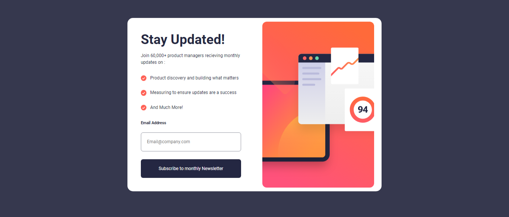

# Frontend Mentor - Newsletter sign-up form with success message solution

This is a solution to the [Newsletter sign-up form with success message challenge on Frontend Mentor](https://www.frontendmentor.io/challenges/newsletter-signup-form-with-success-message-3FC1AZbNrv). Frontend Mentor challenges help you improve your coding skills by building realistic projects.

## Table of contents

- [Overview](#overview)
  - [Screenshot](#screenshot)
  - [Links](#links)
  - [Built with](#built-with)
- [Author](#author)

## Overview

Users should be able to:

- Add their email and submit the form
- See a success message with their email after successfully submitting the form
- See form validation messages if:
  - The field is left empty
  - The email address is not formatted correctly
- View the optimal layout for the interface depending on their device's screen size
- See hover and focus states for all interactive elements on the page

### Screenshot

### Links

- LinkedIn [Linkedin](https://www.linkedin.com/in/mohammad-saeedi-8243512bb/)
- Live Demo [Live Demo](https://mohammadsaeediaf.github.io/newsletter-signup-page/)

### Built with

- HTML5
- CSS3
- Flexbox
- CSS Grid
- Mobile-first workflow

## Author

- Frontend Mentor: [@Mohammadsaeediaf](https://www.frontendmentor.io/profile/mohammadsaeediaf)
